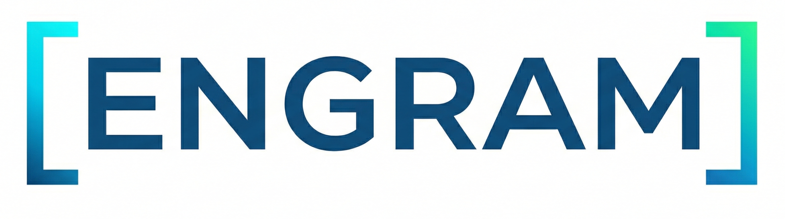

<div align="center">

</img>

### AI models that remember

[](https://github.com/sgl-project/sglang)
[](LICENSE) [](https://deepwiki.com/Clarit-AI/Engram) 


Stop re-reading every conversation from scratch.
Save model state. Restore in 2ms. Cut token costs by 94%.

[Quick Start](#quick-start) | [Benchmarks](#benchmarks) | [API Guide](docs/stateful_mamba/api_guide.md) | [Architecture](#how-it-works)

</div>

---

## The Problem: Every AI Conversation Starts From Scratch

When you talk to an AI assistant, every message you send includes the *entire* conversation history. The model reads through everything — your first message, its reply, your follow-up, its reply, and so on — before it can respond to your latest question. Every. Single. Time.

For a short chat, you don't notice. But for a 50-turn conversation, an ongoing project, or an agent running a multi-step task, it adds up fast. The model is re-reading a novel just to write the next paragraph. You're paying for all those tokens. And it's getting slower with every turn.

This happens because today's serving infrastructure treats model state as disposable. Once a response is generated, everything the model understood about your conversation is thrown away. The next request starts from zero.

**What if the model could just... remember where it left off?**

That's what Engram does. New-generation models (Mamba, Mamba2, and hybrids from IBM, NVIDIA, and Alibaba) maintain a compact internal state — a compressed summary of everything they've read. Unlike traditional transformer caches that grow with conversation length, this state stays the same size whether the conversation is 100 tokens or 100,000.

Engram saves that state. Restore it later in about 2 milliseconds. Skip re-reading the entire conversation. Pick up exactly where you left off.

The result: **93.8% fewer tokens processed** on multi-turn conversations. A conversation that takes 6.5 seconds to restart from scratch restores in 2ms. The saved state is constant-size regardless of how long the conversation is.*

<sub>* Snapshot sizes range from ~47MB to ~5.3GB depending on model size and architecture. A 4B-parameter model saves ~56MB; NVIDIA's 120B-parameter flagship saves ~5.3GB. The key property is that snapshot size is fixed for a given model — a 1M-token conversation saves the same bytes as a 1K-token one. All benchmarks measured on IBM Granite 4.0-H-tiny (4B, BF16) unless otherwise noted. See [Benchmarks](#benchmarks) for the full model breakdown.</sub>

---

## What is Engram?

Engram adds persistent state infrastructure to [SGLang](https://github.com/sgl-project/sglang), the high-performance LLM serving engine used across 400,000+ GPUs worldwide. It targets Mamba and Mamba2 hybrid models specifically, turning their hidden state from disposable inference overhead into a durable memory asset.

Snapshot persistence, a 3-tier memory hierarchy (VRAM → RAM → disk), configurable retention policies, and an agent tool framework — all built on top of SGLang's existing infrastructure without breaking any of its capabilities.

## Built on SGLang

Engram is a maintained fork of [sgl-project/sglang](https://github.com/sgl-project/sglang), the serving engine that powers inference across 400,000+ GPUs worldwide. Everything SGLang does — RadixAttention, continuous batching, tensor parallelism, OpenAI-compatible APIs, broad model and hardware support — Engram inherits and stays current with.

The fork adds a focused set of extensions for Mamba SSM state persistence. Upstream SGLang compatibility is maintained through automated sync tooling that merges non-conflicting upstream changes twice weekly.

## Benchmarks

Validated on H200 across the full test suite (77/82 pass, 0 regressions):

| Metric | Result |
|--------|--------|
| **Token reduction** | 93.8% average across 271 requests, zero failures |
| **Snapshot restore** | ~2ms warm restore (vs. 6.5s full prefill at 128K context) |
| **Speedup at 128K** | ~3,250x faster than full prefill |
| **Snapshot size** | Constant per model, regardless of context length |
| **Memory stability** | Zero leaks, stable VRAM under sustained load |

#### Snapshot Sizes by Model

| Model | Params | Snapshot Size | Notes |
|-------|--------|--------------|-------|
| Qwen3-Next-80B-A3B (TP4) | 80B/3B active | ~19 MB | Smallest — MoE with small hidden_size |
| Granite 4.0-H-tiny (TP4) | 4B | ~14 MB | TP=4 gathers state to rank 0 |
| Granite 4.0-H-tiny (TP1) | 4B | ~56 MB | Primary benchmark model |
| Granite 4.0-H-small | 32B | ~146 MB | 36 Mamba layers, BF16 |
| Codestral Mamba 7B | 7B | ~260 MB | Pure Mamba2 — large SSM state (64 layers) |
| Nemotron-3-Super-120B | 120B | ~5.3 GB | 88 layers, FP8, LatentMoE |

All sizes are constant regardless of conversation length — a 1M-token conversation saves the same bytes as a 1K-token one.

### Tested Models

7 models validated across 4 vendors. Pure Mamba2 support is an Engram-only capability — upstream SGLang cannot run these models.

| Model | Vendor | Architecture | Token Reduction | Snapshot Size | Status |
|-------|--------|-------------|-----------------|---------------|--------|
| Granite 4.0-H-tiny (4B) | IBM | Dense Mamba2 hybrid | 93.8% | 56MB (TP1), 14MB (TP4) | PASS |
| Granite 4.0-H-small (32B) | IBM | Dense Mamba2 hybrid | — | ~146MB | PASS |
| Codestral Mamba 7B | Mistral | **Pure Mamba2** | 67.1% | 260MB | **PASS (NEW)** |
| Qwen3-Next-80B-A3B | Alibaba | Mamba2+Attn+MoE | 82.0% | 19MB (TP4) | **PASS (NEW)** |
| Nemotron-Cascade-2-30B | NVIDIA | MoE Mamba2 hybrid | — | — | PASS |
| Nemotron-3-Super-120B FP8 | NVIDIA | LatentMoE Mamba2 hybrid | — | — | BLOCKED (SM89+) |
| Qwen3-Coder-Next FP8 | Alibaba | Gated Linear Attention + MoE | — | — | PASS |

## Quick Start

```bash
# Install
pip install -e "python/"

# Start server with snapshot persistence
python -m sglang.launch_server \
  --model-path ibm-granite/granite-4.0-h-tiny \
  --enable-snapshot-persistence \
  --snapshot-dir ./snapshots \
  --mamba-scheduler-strategy no_buffer \
  --disable-radix-cache \
  --port 30000

# Chat normally via OpenAI-compatible API
curl http://localhost:30000/v1/chat/completions \
  -H "Content-Type: application/json" \
  -d '{
    "model": "granite-4.0-h-tiny",
    "messages": [{"role": "user", "content": "Explain quantum computing"}],
    "max_tokens": 256
  }'

# Save conversation state
curl http://localhost:30000/save_snapshot \
  -H "Content-Type: application/json" \
  -d '{"conversation_id": "session-1"}'

# Restore it later — ~2ms, skip entire prefill
curl http://localhost:30000/restore_snapshot \
  -H "Content-Type: application/json" \
  -d '{"conversation_id": "session-1"}'
```

## How It Works

Mamba SSM layers maintain a fixed-size hidden state that compresses the entire conversation history. Unlike transformer KV caches (which grow linearly with context), this state stays constant regardless of how long the conversation gets.

Engram adds four things to SGLang to exploit this property:

**Snapshot persistence** — Save and restore complete Mamba hidden state to disk. The snapshot captures the model's full compressed understanding of a conversation at any point, and can be restored in a future session without re-processing any of the original tokens.

**3-tier memory hierarchy** — VRAM, host RAM, and disk, with configurable promotion and eviction. Hot sessions stay in VRAM for sub-millisecond restore. Warm sessions sit in host RAM. Cold sessions persist on disk. The tier manager handles movement automatically.

**Retention policies** — Configurable rules for how long snapshots live at each tier, when they get promoted or evicted, and which sessions are prioritized. Think of it as memory management for conversations.

**Agent tool framework** — Built-in tools that let agents leverage persistent state: save checkpoints, branch conversations, restore prior context. REST and WebSocket interfaces for integration.

### Architecture

```
┌─────────────────────────────────────────────────┐
│                 OpenAI-Compatible API            │
├─────────────────────────────────────────────────┤
│              SGLang Serving Engine               │
│    (scheduler, batching, tensor parallelism)     │
├──────────────┬──────────────────────────────────┤
│  Engram      │  Snapshot Manager                 │
│  Extensions  │  ├─ save / restore / list / delete│
│              │  ├─ Conversation Tracker           │
│              │  └─ Snapshot Hooks & Policies      │
│              ├──────────────────────────────────┤
│              │  Tier Manager                     │
│              │  ├─ VRAM  (hot, ~2ms restore)     │
│              │  ├─ RAM   (warm, ~10ms restore)   │
│              │  └─ Disk  (cold, ~50ms restore)   │
│              ├──────────────────────────────────┤
│              │  Mamba State Extensions            │
│              │  ├─ MambaRadixCache (dual LRU)    │
│              │  ├─ HybridReqToTokenPool          │
│              │  └─ Mamba2Metadata                │
├──────────────┴──────────────────────────────────┤
│              Mamba / Mamba2 Models                │
│    (pure SSM, dense hybrid, MoE hybrid)          │
└─────────────────────────────────────────────────┘
```

## API Extensions

Engram extends SGLang's API with snapshot management endpoints. All existing SGLang endpoints work unchanged.

For most developers, start with the user-friendly [API Guide](docs/stateful_mamba/api_guide.md).
For the exact technical contract and current implementation quirks, use
[HTTP API Spec](docs/stateful_mamba/http_api_spec.md).

| Endpoint | Method | Description |
|----------|--------|-------------|
| `/save_snapshot` | POST | Save current conversation state |
| `/restore_snapshot` | POST | Restore a previously saved state |
| `/list_snapshots` | POST | List all saved snapshots for a conversation |
| `/get_snapshot_info` | POST | Fetch metadata for one selected snapshot |
| `/delete_snapshot` | POST | Remove a saved snapshot |

### Server Flags

| Flag | Description |
|------|-------------|
| `--enable-snapshot-persistence` | Enable the snapshot system |
| `--snapshot-dir <path>` | Directory for snapshot storage |
| `--mamba-scheduler-strategy <strategy>` | Scheduler strategy (`no_buffer`, `extra_buffer`) |

## Key Source Files

| File | Purpose |
|------|---------|
| `python/sglang/srt/snapshot/mamba_snapshot.py` | Core snapshot save/load logic |
| `python/sglang/srt/snapshot/tier_manager.py` | 3-tier memory hierarchy (VRAM/RAM/disk) |
| `python/sglang/srt/snapshot/snapshot_policy.py` | Retention and trigger policies |
| `python/sglang/srt/snapshot/conversation_tracker.py` | Session state tracking |
| `python/sglang/srt/mem_cache/mamba_radix_cache.py` | Dual-LRU cache with COW support |
| `python/sglang/srt/mem_cache/memory_pool.py` | Hybrid memory pools for Mamba state |
| `python/sglang/srt/agents/` | Agent tool framework |
| `python/sglang/snapshot.py` | Public API (SnapshotManager) |

## Development

```bash
# Run unit tests (no GPU required)
pytest test/sglang/snapshot/ -v
pytest python/sglang/test/srt/test_mamba_metadata.py -v
pytest python/sglang/test/srt/test_mamba_pool_extended.py -v

# Run server integration tests (GPU required)
# See test/phases/ for the full phased test suite

# Lint
pre-commit run --all-files
```

## License

Same license as SGLang. See [LICENSE](LICENSE).

## Acknowledgments

Engram is built on [SGLang](https://github.com/sgl-project/sglang) by the [LMSYS](https://lmsys.org/) organization. SGLang is a high-performance serving framework trusted across 400,000+ GPUs worldwide, backed by contributions from xAI, AMD, NVIDIA, Intel, and dozens of research institutions. We are grateful to the SGLang team for building the foundation that makes this work possible.

We also build on the broader ecosystem that SGLang acknowledges: [vLLM](https://github.com/vllm-project/vllm), [FlashInfer](https://github.com/flashinfer-ai/flashinfer), [Guidance](https://github.com/guidance-ai/guidance), [LightLLM](https://github.com/ModelTC/lightllm), [Outlines](https://github.com/outlines-dev/outlines), and [LMQL](https://github.com/eth-sri/lmql).

The Mamba architecture was developed by Albert Gu and Tri Dao. Mamba2 was developed by Tri Dao and Albert Gu at Carnegie Mellon University.

## Support Engram

Engram is an open-source project focused on building more efficient AI infrastructure through true stateful inference.

We're exploring ways to scale development, expand model support, and validate performance in larger production environments.

If you're interested in supporting development, contributing compute resources, or exploring partnerships, feel free to reach out:

👉 https://clarit.ai
